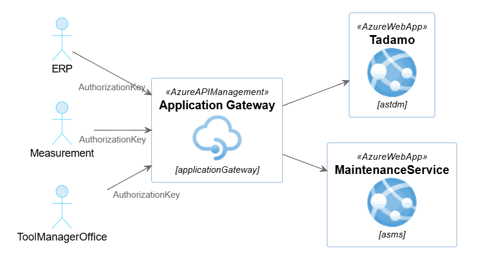

# API Connectivity

## Overview
The tapio allows integration partners to connect ERP systems, Tool Managers, and measurement systems with tapio services.  
Partners can securely access Tadamo and MaintenanceService (MS) APIs through **AuthorizationKeys** generated from add-ons.

### Supported Add-ons
- **ERP Add-on (SharpeningUI)**  
- **Measurement Add-on (SharpeningUI)**  
- **ToolManagerOffice Add-on (Twinio)**  

Each add-on can generate its own **AuthorizationKey**, which serves as the credential for API access.

## 🔑 Authentication

### AuthorizationKey

An **AuthorizationKey** is issued via the add-on settings in the tapio portal.  
- The key is generated by the customer and shared with the integration partner (e.g., ERP, Measurement, or Tool Manager system).
- The key is **valid until explicitly revoked**.

### Scope

Keys are scoped to the customer subscription and application.

## ⚙️ Add-on Configuration

- Go to the tapio portal.

- Navigate to the relevant Add-on (ERP, Measurement, ToolManagerOffice).

- Create an AuthorizationKey (one-time copy).

- Paste the key into your integration system configuration.

## 🔄 Data Flow

- ERP / Measurement / ToolManager → calls TADAMO or MaintenanceService with AuthorizationKey.

- Tadamo/MS validate AuthorizationKey with subscriptionId and applicationId.

- SharpeningUI and Twinio act as the customer-facing add-ons where keys are managed.

## 💻 Code Samples

For practical implementation examples of how to configure authentication for the TadamoApiClient and MaintenanceServiceApiClient, see the code samples and documentation at:

**[tapio Auth API Documentation](https://tapioone.github.io/tapio-samples/)**

This resource provides detailed examples and best practices for implementing authentication configuration for both API clients.