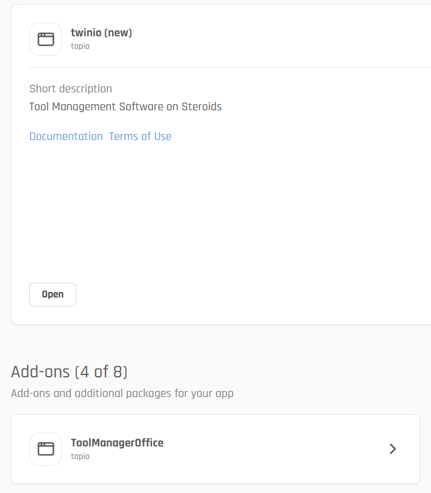
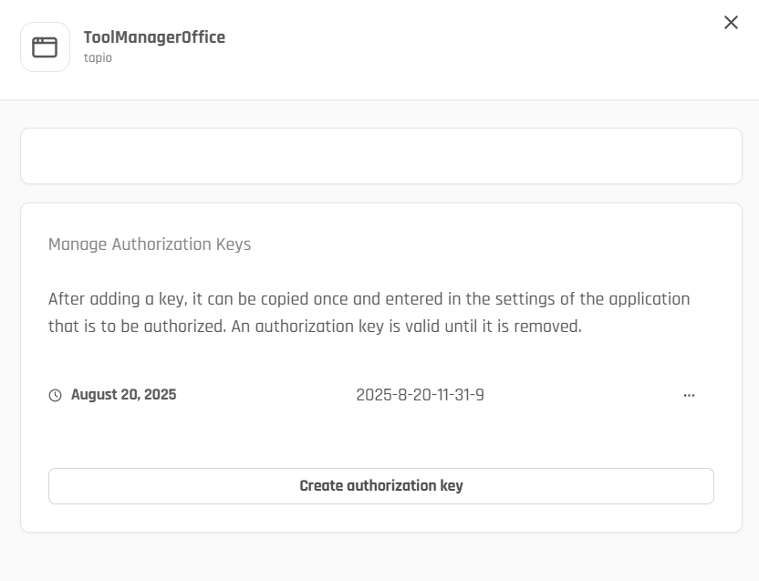

# API Connectivity

## Overview
The tapio allows integration partners to connect ERP systems, Tool Managers, and measurement systems with tapio services.  
Partners can securely access Tadamo and MaintenanceService (MS) APIs through **AuthorizationKeys** generated from add-ons.

### Supported Add-ons
- **ERP Add-on (SharpeningUI)**  
- **Measurement Add-on (SharpeningUI)**  
- **ToolManagerOffice Add-on (Twinio)**  

Each add-on can generate its own **AuthorizationKey**, which serves as the credential for API access.

## 🔑 Authentication

### AuthorizationKey

An **AuthorizationKey** is issued via the add-on settings in the tapio portal.  
- The key is generated by the customer and shared with the integration partner (e.g., ERP, Measurement, or Tool Manager system).
- The key is **valid until explicitly revoked**.

### Scope

Keys are scoped to the customer subscription and application.

## ⚙️ Add-on Configuration

- Go to the tapio portal.

- Navigate to the relevant Add-on (ERP, Measurement, ToolManagerOffice).


- Create an AuthorizationKey (one-time copy).


- Paste the key into your integration system configuration.

## 🔄 Data Flow

- ERP / Measurement / ToolManager → calls TADAMO or MaintenanceService with AuthorizationKey.

- Tadamo/MS validate AuthorizationKey with subscriptionId and applicationId.

- SharpeningUI and Twinio act as the customer-facing add-ons where keys are managed.

```plantuml
@startuml azure-architecture

' azure symbols
!define AzurePuml https://raw.githubusercontent.com/plantuml-stdlib/Azure-PlantUML/master/dist
!includeurl AzurePuml/AzureCommon.puml
!includeurl AzurePuml/Databases/AzureSqlDatabase.puml
!includeurl AzurePuml/Networking/AzureCDNProfile.puml
!includeurl AzurePuml/Compute/AzureFunction.puml
!includeurl AzurePuml/Web/AzureWebApp.puml
!includeurl AzurePuml/Security/AzureKeyVault.puml
!includeurl AzurePuml/Integration/AzureServiceBus.puml
!includeurl AzurePuml/DevOps/AzureApplicationInsights.puml
!includeurl AzurePuml/Storage/AzureStorage.puml
!includeurl AzurePuml/Analytics/AzureEventHub.puml
!includeurl AzurePuml/Analytics/AzureDataExplorer.puml
!includeurl AzurePuml/Compute/AzureServiceFabric.puml
!includeurl AzurePuml/Databases/AzureRedisCache.puml
!includeurl AzurePuml/Storage/AzureBlobStorage.puml
!includeurl AzurePuml/Storage/AzureQueueStorage.puml
!includeurl AzurePuml/Compute/AzureFunction.puml
!includeurl AzurePuml/Web/AzureSearch.puml
!includeurl AzurePuml/Integration/AzureServiceBus.puml
!includeurl AzurePuml/Web/AzureAPIManagement.puml


left to right direction
' skinparam linetype ortho
skinparam linetype polyline

skinparam actor {
  BorderColor DeepSkyBlue
  BackgroundColor #d6eaf8
}
skinparam component {
  BorderColor DeepSkyBlue
  BackgroundColor #d6eaf8
}

actor ERP
actor Measurement
actor ToolManagerOffice

AzureAPIManagement(applicationGateway, "Application Gateway", applicationGateway)
AzureWebApp(apiTadamo, "Tadamo", "astdm")
AzureWebApp(apiMaintenanceService, "MaintenanceService", "asms")

[ERP] -->"AuthorizationKey" [applicationGateway]
[Measurement] -->"AuthorizationKey" [applicationGateway]
[ToolManagerOffice] "AuthorizationKey"--> [applicationGateway]


[applicationGateway] --> [apiTadamo]
[applicationGateway] --> [apiMaintenanceService]
@enduml
```

## 💻 Code Samples

For practical implementation examples of how to configure authentication for the TadamoApiClient and MaintenanceServiceApiClient, see the code samples and documentation at:

**[tapio Auth API Documentation](https://tapioone.github.io/tapio-auth-api/)**

This resource provides detailed examples and best practices for implementing authentication configuration for both API clients.