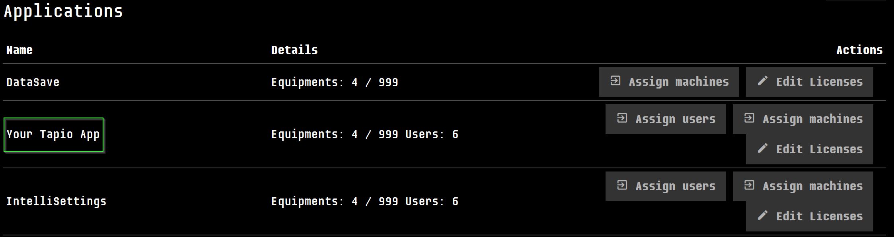

# Register your tapio Application

When your company has successfully registered as a tapio partner, someone in your organization will receive access to a tapio subscription. This subscription is the basis for the administration of applications, machines and users trough [my tapio](https://my.tapio.one). The administrator of your company's subscription can [invite you to the subscription](https://www.youtube.com/watch?v=GDBBNllL-Q8).  

> If you're not already a tapio partner, don't hesitate to get in touch with us via `partner@tapio.one`.

Since you're here to develop an application, we first need to ensure that your application appears in your subscription in [my tapio](https://my.tapio.one), so you can assign machines and users to it.

_____________________________________________________________________

To register your application at tapio, please provide the following information via email to developer@tapio.one.

| Information                                                                                                                     | Description                                                                                                                                                                                                                          |
| ------------------------------------------------------------------------------------------------------------------------------- | ------------------------------------------------------------------------------------------------------------------------------------------------------------------------------------------------------------------------------------ |
| Name                                                                                                                            | Name of your application                                                                                                                                                                                                             |
| Contact Mail                                                                                                                    | E-Mail address of the technical contact for your application                                                                                                                                                                         |
| SubscriptionId                                                                                                                  | tapio subscription id to test the application with. You can find it in [my tapio](https://my.tapio.one).                                                      |
| Authentication Infos (**We assume you have knowledge on the OAuth2 authentication protocol**)                                   |                                                                                                                                                                                                                                      |
|                                                                                                                                 | Are you developing a web application? (y/n)                                                                                                                                                                                          |
|                                                                                                                                 | If you're not sure, which OAuth2 Flow to use, read [this](https://auth0.com/docs/api-auth/which-oauth-flow-to-use) and consider reading our documentation about [authentication](./authentication)                                   |
|                                                                                                                                 | Please list your valid redirect-URIs                                                                                                                                                                                                 |
| Information for [my tapio](https://my.tapio.one)                                                                                |                                                                                                                                                                                                                                      |
|                                                                                                                                 | Is it possible to assign **users** to your application? (y/n)                                                                                                                                                                        |
|                                                                                                                                 | Is it possible to assign **machines** to your application? (y/n)                                                                                                                                                                     |
|                                                                                                                                 | Does your application support machines with limited connection? (y/n) . For more information on connectivity read our [connectivity guide](../machine-data/connectivity) |
| Which data does your application need? (see [tapio Data Types](../machine-data/tapio-data-categories) for a detailed description) |                                                                                                                                                                                                                                      |
|                                                                                                                                 | Last known state of machines?                                                                                                                                                                                                        |
|                                                                                                                                 | Streaming data? if yes :arrow_right: provide an [Azure EventHub](https://azure.microsoft.com/de-de/services/event-hubs/) connection string, including the event hub name (the send claim should be set).                             |
|                                                                                                                                 | BatchData? if yes :arrow_right: provide an [Azure StorageAccount](https://azure.microsoft.com/de-de/services/storage/) Queue connection string and the queue name.                                                                   |
|                                                                                                                                 | Does your application expose data via a Web API that can be called by others? if yes :arrow_right: provide the URL & a documentation to this API. (See also [Call Endpoint](../manufacturer/cloud-connector/call-endpoint))            |
|                                                                                                                                 | Does your application communicate with the machines? (See  [Commanding](../machine-data/commanding))                                                                                                                                 |
|                                                                                                                                 | Do you want to build an application, which also runs on a tapio connected machine?                                                                                                                                                   |

_____________________________________________________________________

When you have answered the questions from above, your application will be created in our Azure Active Directory (AAD) and you will receive the following information:

* AAD Authority &rightarrow; this is usually `https://login.microsoftonline.com/tapiousers.onmicrosoft.com` and represents the url, where your application will try to log on.
* ClientId &rightarrow; the identifier of your application within our AAD
* ClientSecret &rightarrow; a password, that allows to login as your application
* AppId URI &rightarrow; This is the identifier of your application. Usually looks something like `https://tapiousers.onmicrosoft.com/YourApplicationName`
* tapio SignIn Policy Name &rightarrow; The name of the policy, which does the actual user login

You'll need this information to authenticate against tapio APIs and enable users to login to your application with their tapio account.

**You should now continue with reading our detailed guide on** [**Authentication**](./authentication).
