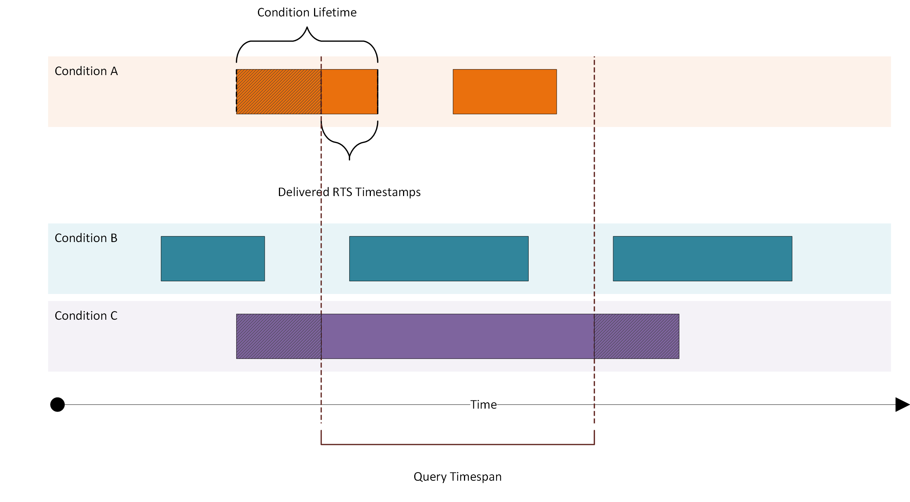

# Read Historical Data of a Machine

## Introduction

tapio's historic data API enables retrieving of historic machine data. You can retrieve historic data of your machines, for example to implement analytic solutions. As you might have already read something about [tapio Data Categories](./TapioDataCategories) you know that there is `streaming` and `batch` data. Both `streaming` and `batch` data are written into the historical database. The database archives three different sub-types of `streaming` and `batch` data: `Conditions`, `Item Data` and `Control messages`.  
An example use case of this feature would be analyzing the electrical power consumption of a machine over a certain time range.

The historic data processing may not contain the most recent data due offline machine state or ongoing processing procedure.

> **Important:** our historic data API is currently in a preview state. More features are under development and will be published soon.

## General

To be able to make requests to the historic data API, you first need to [register a tapio application](../General/RegisterTapioApplication) and assign machines to the application. **You won't receive data** for machines that are not assigned to your application.  
**Authentication** for State API is done via Azure AD B2C. See our [guide on authentication](../General/Authentication#non-interactive-authentication) for more details.

> NOTE: Use `Content-Type: application/json;charset=UTF-8` in your request headers
<!-- -->
> Use the ResourceId `https://tapiousers.onmicrosoft.com/CoreApi` for the token request otherwise you get an Unauthorized.

## Read Source Keys

We're sure you wonder what "source keys" are right now. When we talk about `source keys` in context of the historic data API, we mean the actual key of a machine data object. This could for example be something like `Energy!AirPressure`. You can read more about the data structure of machine data [in the detailed guide on machine data](./TapioDataCategories#item-data).  
This query won't return actual data, meaning for example values of `Energy!AirPressure`. It will return those source keys, for which historic data is available.

You can retrieve the source keys that occurred in the past for a machine, using the following API route:

`GET https://core.tapio.one/api/machines/historic/tmids/{tmid}/items/keys`

> Use the ResourceId `https://tapiousers.onmicrosoft.com/CoreApi` for the token request otherwise you get an Unauthorized.

The {tmid} represents the ID your tapio machine.

> Each request to the historic data API addresses only one tapio machine. To get data for multiple tapio machines you need to call the API multiple times.

### Response Model Definition

Querying source keys of a machine through the historic data API will return an object which contains the tmid and the available source keys. The query will return the source keys, for which data was obtained in the past.

| Property | Description                                                                | Datatype |
| -------- | -------------------------------------------------------------------------- | -------- |
| tmid     | tapio machine id                                                           | string   |
| keys     | List of **All** source keys for this tapio machine where data is available | string[] |

Basic structure of response body is a `JSON` array containing the source keys that occurred in the past:

```Json
{
  "keys": [
    "State.CurrentStateGroup",
    "Kante!Heizung01.Value",
    "0001-PC87!RestlaufzeitTimePaused",
    "Energy!AirVolumeFlow",
    "Energy!ElectricPower",
    "Energy!AirPressure"
  ]
}
```

## Read Historical Data using the Source-Key Filter

Now that we queried all the source keys, that occurred for a machine in the past, we can use them to retrieve the actual data per source key, within a specific timespan.

To do so, we use the `/items` route within the historic data API. Once again, we pass the tmid here, to tell the API, which machine's data we want to query.

`POST https://core.tapio.one/api/machines/historic/tmids/{tmid}/items`

> NOTE: Use `Content-Type: application/json;charset=UTF-8` in your request headers
> Use the ResourceId `https://tapiousers.onmicrosoft.com/CoreApi` for the token request otherwise you get an Unauthorized.

### Request Model Definition

Since we need to define some more parameters for our query, we need to pass them within the body of our request:

| Property | Description                                          | Datatype | Mandatory | Default                |
| -------- | ---------------------------------------------------- | -------- | --------- | ---------------------- |
| from     | Start date and time, ISO8601 format                  | string   | No        | End date minus 30 days |
| to       | End date and time, ISO8601 format                    | string   | No        | Current date and time  |
| keys     | Keys for which data should be returned               | string[] | Yes       |                        |
| limit    | Limits the number of results per key (sorted by rts) | int      | No        | 1000                   |

If you don't provide any key within the `keys` parameter, you'll retrieve data for all source keys, that are available for that machine, within the given timespan.

Here's an example on how your `JSON` request body can look like:

```Json
{
  "from": "2018-06-05T08:15:29.1234Z",
  "to": "2018-06-10T08:15:29.1234Z",
  "keys": [
    "State.CurrentStateGroup",
    "Kante!Heizung01.Value"
  ],
  "limit": 1
}
```

This request will return the latest value of `Kante!Heizung01.Value`, as well as `State.CurrentStateGroup`, since the limit applies per source key.

> If you pass e.g. `100` as your limit parameter, you might retrieve **80** objects for `State.CurrentStateGroup`, and **100** objects for `Kante!Heizung01.Value`.

### Response Model Description

As a response to this query, you will retrieve an array of objects, wrapping the actual data with the following properties:

| Property          | Description                                                                                            | Datatype                                              |
| ----------------- | ------------------------------------------------------------------------------------------------------ | ----------------------------------------------------- |
| key               | Name of the source key                                                                                 | string                                                |
| value             | Historic data for the source key                                                                       | [HistoricItemData](./TapioDataCategories#item-data)[] |
| moreDataAvailable | **true** when there there is more data available than returned. Increase limit or decrease date range. | bool                                                  |

> When there is more data available for your key, you need to increase your limit or change the time span, in order to retrieve all the data. We currently do not support other sorting mechanisms or something like that.

#### HistoricalItemData Model Description

The content of the `value` property, has the following structure:

| Property | Description                                                                                                        | Datatype |
| -------- | ------------------------------------------------------------------------------------------------------------------ | -------- |
| rts_utc  | Receive time stamp, ISO8601 format                                                                                 | string   |
| k        | Key name, usually an OPC UA node id, can be configured by machine manufacturer in the CloudConnector configuration | string   |
| vt       | Data value type, defines the datatype of the value property `v`                                                    | string   |
| v        | The value, defined by value type property `vt`                                                                     | dynamic  |
| vNum     | The OPC-UA value as number, if available; otherwise ‘null’                                                         | number   |
| u        | Unit of the value, e.g. `c` for celsius                                                                            | string   |
| q        | Quality of the value, as reported by OPC UA server, `g` is good, `b` is bad, `u` is uncertain                      | string   |
| sts      | Source time stamp, ISO8601 format                                                                                  | string   |
| rts      | Receive time stamp, ISO8601 format                                                                                 | string   |

An example `JSON` response will then look something like this:

```Json
[
  {
    "key": "State.CurrentStateGroup",
    "values": [
      {
        "rts_utc": "2018-06-10T08:15:29.1234Z",
        "k": "State",
        "v": 1,
        "vNum": 1,
        "vt": "f",
        "u": "C",
        "q": "g",
        "sts": "2018-06-05T08:15:29+02:00",
        "rts": "2018-06-05T08:15:30+02:00"
      }
    ],
    "moreDataAvailable": true
  },
  {
    "key": "Kante!Heizung01.Value",
    "values": [
      {
        "rts_utc": "2018-06-10T08:17:29.1234Z",
        "k": "Temperature",
        "v": 24.7,
        "vNum": 24.7,
        "vt": "f",
        "u": "C",
        "q": "g",
        "sts": "2018-06-05T08:17:29+02:00",
        "rts": "2018-06-05T08:17:35+02:00"
      }
    ],
    "moreDataAvailable": true
  }
]
```

## Historic conditions

The condition data api allows to receive the state of conditions over a specific time frame

`POST https://core.tapio.one/api/machines/historic/tmids/{tmid}/conditions`

> NOTE: Use `Content-Type: application/json;charset=UTF-8` in your request headers
> Use the ResourceId `https://tapiousers.onmicrosoft.com/CoreApi` for the token request otherwise you get an Unauthorized.

### Historic conditions Request Model

```json
{
  "from":"2018-06-05T08:15:29.1234Z",
  "to":"2018-06-10T08:15:29.1234Z"
}
```

| Property | Description                             | Datatype | Mandatory | Default                |
| -------- | --------------------------------------- | -------- | --------- | ---------------------- |
| from     | UTC start date and time, ISO8601 format | string   | no        | End date minus 30 days |
| to       | UTC end date and time, ISO8601 format   | string   | no        | Current date and time  |

### Historic conditions Response Model

```json
{
  "values": [
    {
      "key": "heater1",
      "provider": "Heating",
      "values": [
        {
          "sts": "2018-06-05T06:09:29+02:00",
          "rts_utc_start": "2018-06-10T08:15:29.1234Z",
          "rts_start": "2018-06-10T06:15:29.1234+02:00",
          "rts_utc_end": "2018-06-10T08:16:19.1356Z",
          "rts_end": "2018-06-10T06:16:19.1356+02:00",
          "rts_utc_end_quality": "g",
          "p": "Heating",
          "k": "Heating90PercentReached",
          "s": "HeatingAggregate01",
          "sv": 100,
          "ls": {
            "additionalProp1": "string",
            "additionalProp2": "string",
            "additionalProp3": "string"
          },
          "lm": {
            "additionalProp1": "string",
            "additionalProp2": "string",
            "additionalProp3": "string"
          },
          "vls": {
            "additionalProp1": {
              "v": 22.0,
              "t": "f"
            },
            "additionalProp2": {
              "v": 22.0,
              "t": "f"
            },
            "additionalProp3": {
              "v": 22.0,
              "t": "f"
            }
          }
        }
      ]
    }
  ]
}
```

Container:

| Property       | Description                                                 | Datatype        |
| -------------- | ----------------------------------------------------------- | --------------- |
| values         | a list of the condition data sorted by key                  | ConditionData[] |
| value.key      | the identifier of one condition                             | string          |
| value.provider | Provider of one condition                                   | string          |
| value.values   | a historic list of active conditions, see below for details | Entry[]         |

Entry:

For a detailed description of the fields see [tapio data catagories](./TapioDataCategories#condition).

| Property            | Description                                                                                                          | Datatype |
| ------------------- | -------------------------------------------------------------------------------------------------------------------- | -------- |
| sts                 | Source timestamp, ISO8601 format, used as identifier                                                                 | string   |
| rts_utc_start       | Condition active start if inside query range or null if not, ISO8601 format as UTC timestamp                         | string   |
| rts_start           | Condition active start if inside query range or null if not, ISO8601 format with local offset                        | string   |
| rts_utc_end         | Condition active end if inside query range or null if not, ISO8601 format as UTC timestamp                           | string   |
| rts_end             | Condition active end if inside query range or null if not, ISO8601 format with local offset                          | string   |
| rts_utc_end_quality | Quality of end time based on received data (`'g'` - good) or calculated (`'u'` - uncertain) or not in range (`null`) | string   |
| p                   | Provider identifier                                                                                                  | string   |
| k                   | Key, usually the OPC UA node id of the condition                                                                     | string   |
| s                   | Source id, usually the parent OPC UA node id where the CloudConnector checks for conditions                          | string   |
| sv                  | Severity of the condition                                                                                            | number   |
| ls                  | Localized source string of the condition                                                                             | object   |
| lm                  | Localized message string of the condition                                                                            | object   |
| vls                 | Additional value list                                                                                                | object   |

The following picture represents the logic behind the condition query:



The RTS start and RTS end timestamps of the condition defining the lifetime of one condition, if the value is outside of the queried range it will be set to `null`, also the rts end quality marker is set to `null` in this case.
The quality marker of the rts end is used to differ between a explicit end send by the machine and an assumed
end by the tapio core system. This uncertain quality marker can occur when the `inactive`-notification is lost,
e.g. network errors. The other condition data represents the data received by the messages.
See also [Condition Constraints](../Manufacturer/CloudConnector/ConditionConstraints) for a more detailed description of condition transfer.

If you have any further questions regarding our historic data API, don't hesitate to contact [developer@tapio.one](mailto:developer@tapio.one?Subject=Question%20About%20Historic%20Data)
