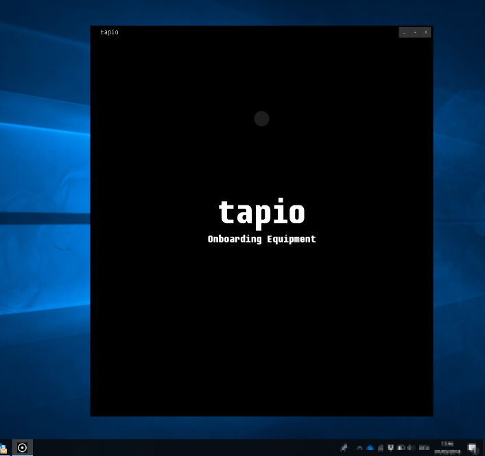

# tapio Activator

tapio Activator is a piece of software, which we're using to onboard your CloudConnector ( the physical world of woodworking machinery), with our digital ecosystem. It gets installed on the machine itself, or on a computer, which has network access to the machine.

## Installation

To install the tapio CloudConnector on your machine, you can use the .msi setup, provided to you by tapio. When you did that you have in the same directory an .exe to start the Activator.

## Start Activator

You can launch the Activator window in three different ways. If you do not add arguments the application will start with it normal size (see picture).

1. Start Activator without a parameter -> Activator starts as seen in the picture below
2. When you pass the parameter "-Maximized" -> Activator will start maximized
3. Wenn you pass the parameter "-Minimized" -> Activator will start minimized

For example execute the command in the correct directory "Activation.exe -Maximized".

You are also able to pass this parameters, when you use short cut. Just add it at the end of your Activator .exe path.

