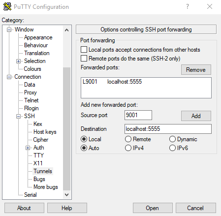

# Install CloudConnector on a Raspberry Pi

## Install Raspbian

- [Install](https://www.raspberrypi.org/documentation/installation/installing-images/README.md) the latest version of Raspbian. The headless `Raspbian Lite` version is recommended.
- Enable the `SSH`-Service by [creating an `ssh` file](https://www.raspberrypi.org/documentation/remote-access/ssh/) on the boot partition of the flashed image.
- Connect to your Pi using `SSH` and perform an update:

```shell
pi@raspberrypi:~ $ sudo apt update && sudo apt upgrade -y
```

> Tip: You can use `rsync` to copy files to your Pi for further installation steps!

```shell
user@host: ~ $ rsync -v TapioCloudConnector.xml pi@host:/home/pi
```

## Install the required runtimes

[Download](https://dotnet.microsoft.com/download/dotnet-core) the [officially supported](./Index)  `ASP.NET Core` and `.NET Core` `ARM32`-Binaries. You can copy the download links of the binaries and use `wget` to download them to your Pi. Extract the binaries to a new directory e.g. `/usr/share/dotnet` and link the `dotnet`-Binary to `/usr/bin/dotnet`:

```shell
pi@raspberrypi:~ $ sudo mkdir /usr/share/dotnet
pi@raspberrypi:~ $ tar xzf dotnet-runtime-3.0.1-linux-arm.tar.gz -C /usr/share/dotnet
pi@raspberrypi:~ $ tar xzf aspnetcore-runtime-3.0.1-linux-arm.tar.gz -C /usr/share/dotnet
pi@raspberrypi:~ $ sudo ln -s /usr/share/dotnet/dotnet /usr/bin/dotnet
```

You can check if you created the symbolic link correctly by running `which dotnet`:

```shell
pi@raspberrypi:~ $ which dotnet
/usr/bin/dotnet
```

To check if you installed the correct runtime versions of  `.NET Core` and `ASP.NET Core` run `dotnet --info`:

```shell
pi@raspberrypi:~ $ dotnet --info
  It was not possible to find any installed .NET Core SDKs
  Did you mean to run .NET Core SDK commands? Install a .NET Core SDK from:
      https://aka.ms/dotnet-download

Host (useful for support):
  Version: 3.0.1
  Commit:  19942e7199

.NET Core SDKs installed:
  No SDKs were found.

.NET Core runtimes installed:
  Microsoft.AspNetCore.App 3.0.1 [/usr/share/dotnet/shared/Microsoft.AspNetCore.App]
  Microsoft.NETCore.App 3.0.1 [/usr/share/dotnet/shared/Microsoft.NETCore.App]

To install additional .NET Core runtimes or SDKs:
  https://aka.ms/dotnet-download
```

## Install CloudConnector

Follow the [installation guide for linux](./Index#installation-guide-for-linux).

## Access CloudConnector UI

To access the CloudConnector UI you have to forward the local port `5555`. You can do that by creating an `SSH`-Tunnel with [PuTTY](https://www.putty.org/):



Using the configuration above you can access the CloudConnector UI running on your Pi by opening `http://localhost:9001/` in your Webbrowser.

