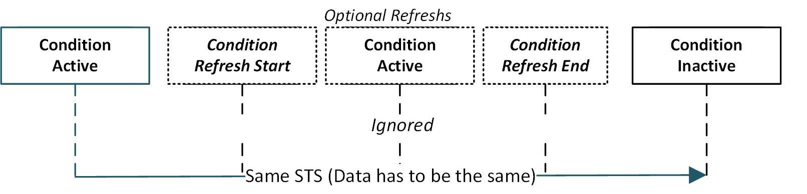
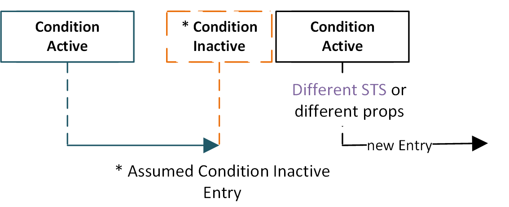
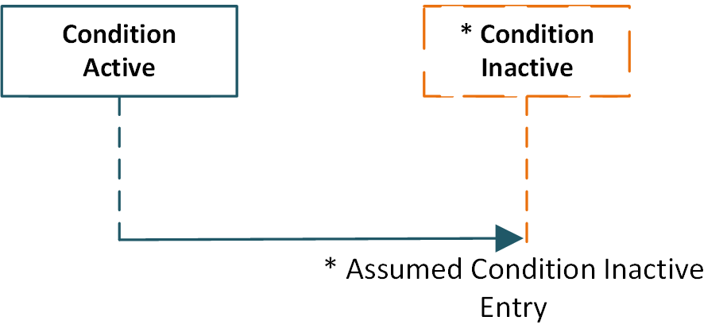

# Constraints for Aggregation of Historic Data

To be able to detect the lifetime of a condition (time frame where a condition is active) the are some rules how the conditions should be reported by the OPC UA server:

Within the OPC UA standard there is no identifier to detect a single "reporting" of a condition, so tapio uses the following properties of a condition transferred by the CloudConnector:

- From OPC UA server: SourceTimeStamp (STS)
- From CloudConnector Config: tapio machine id (tmid)
- From CloudConnector Config: provider
- From OC UA server/CC Config: key

The [tapio Data Categories](../../machine-data/tapio-data-categories) describes the transferred [condition data](../../machine-data/tapio-data-categories#condition) in more detail.

These 4 properties combined mark a single `instance` of a reported condition. To be able to identify the correct `lifetime` of such a condition `instance` there are a few constraints:

- SourceTimeStamp (STS) has to be changed when values of the condition are changed, the condition then counts as new condition `instance`
- Other condition data must not change when setting the active state to FALSE (see [condition data](../../machine-data/tapio-data-categories#condition)).
- The `<CyclicUpdateInSec>600</CyclicUpdateInSec>` Property of OPC UA Source Groups in the CloudConnector config should be lower than 10.5 minutes. The suggested value is 600 seconds / 10 minutes.

The historic occurrence of this condition instances can be queried with the historic data api, see also the description of the [Historic Data](../../machine-data/historical-data).

Visual examples how the condition lifetime in the tapio systems are processed:

The normal dataflow contains a condition active message with several condition refreshes until a condition inactive message is send.

When a condition active/inactive message is received with non matching properties compared to the previous condition, or with a different SourceTimeStamp, the end of this previous condition is set to the received condition timestamp.

When for condition no updates or refreshes are received the condition will be marked as inactive 10.5 minutes after the last matching message.

