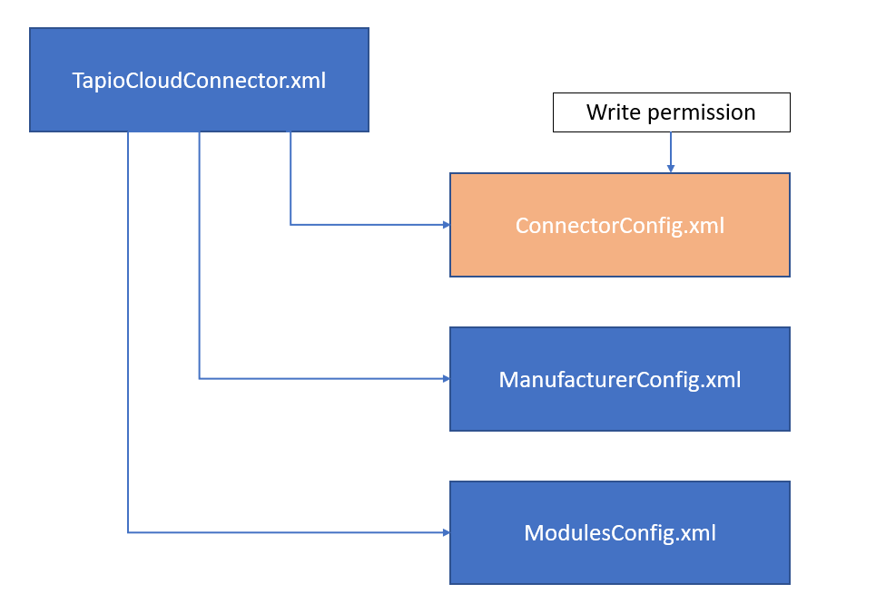
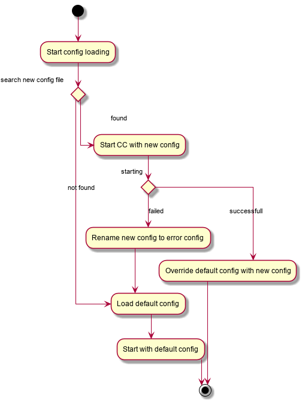
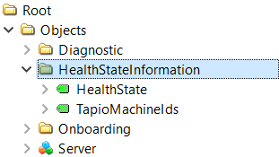

# tapio CloudConnector

tapio CloudConnector is a piece of software, which we're using to connect the physical world of woodworking machinery, with our digital ecosystem. It gets installed on the machine itself, or on a computer, which has network access to the machine. The CloudConnector (**CC**) runs as a service and provides an [**OPC UA Interface**](https://opcfoundation.org/about/opc-technologies/opc-ua/) to receive state and notifications from a machine.

This version of the tapio CloudConnector supports the operating systems Windows and Linux. For both operation systems we support a installer so you are able to choose the correct one. If you want to use the tapio CloudConnector on Linux you have to provide a dotnet core runtime, please note the [system requirements](#system-requirements).

## Installation

To install the tapio CloudConnector on your machine, you can use the .msi setup for Windows or the install.sh scripts for linux, provided to you by tapio.

The installer will ask you to accept our [legal information](#legal-information-of-the-cloudconnector).

- [.NET 6.0](https://github.com/tapioone/CloudConnector/releases/latest/download/tapio.cloudconnector.net60.tar.gz)
- [Linux x64](https://github.com/tapioone/CloudConnector/releases/latest/download/tapio.cloudconnector.linux-x64.tar.gz)
- [Linux ARM](https://github.com/tapioone/CloudConnector/releases/latest/download/tapio.cloudconnector.linux-arm.tar.gz)
- [Windows x86](https://github.com/tapioone/CloudConnector/releases/latest/download/Tapio.CloudConnector.Setup.msi)

> Further information how to install the Linux CloudConnector can you find [here](#installation-guide-for-linux)

### System requirements

**Windows:**

- Windows 7 SP 2 or newer

**Linux:**

- Platform specific builds: Standard C/C++ Libraries + OpenSSL, ICU

## Legal information of the CloudConnector

You will be asked to accept our legal information when installing the CloudConnector.

[Data privacy (en)](https://info.tapio.one/en/data-privacy-only) / [Data privacy (de)](https://info.tapio.one/de/data-privacy-only)

[Imprint (en)](https://info.tapio.one/en/imprint-only) / [Imprint (de)](https://info.tapio.one/de/imprint-only)

 > Make sure when you run the installation in `quiet` mode that we assume that you have read the information and accepted them.

## How to activate a CloudConnector

In order to connect your device to the tapio ecosystem you need to activate your tapio CloudConnector. Depending on your OS and CloudConnector version, you can choose between different options

1. Recommended since version 5.1.x: On Windows and Linux, you can use your browser to activate your CloudConnector. Find more information about browser based activation [here](./uI).
2. Deprecated - only available in older versions: On Windows, you can use the activator application that is installed alongside the tapio CloudConnector. Find more information about the Activator application [here](./activator).

> In any case, you can also use **EasyAdd** if you know the manufacturer serial number of your device.

## Installation guide for linux

To install the tapio CloudConnector on your machine, you can use the `install.sh` script. This is included in the tar.gz or zip file you can
[download](#installation) or you received from the tapio developer support by E-Mail.
Unzip the archive on your machine and follow the step. You can also find those steps in the `readme.md` file which is included in the archive.
Before starting the installation make sure to prepare a CloudConnector configuration for the target machine to have all OPC UA server settings in place.

```console
user@example:~$ tar xzvf tapio.cloudconnector.<platform>.tar.gz
user@example:~$ cd Tapio.CloudConnector.Service
user@example:~$ chmod +x install.sh # optional to make sure executable bit is set
user@example:~$ sudo ./install.sh TapioCloudConnector.xml # path to a valid tapio CloudConnector configuration
```

To install the CloudConnector UI (see [UI](./ui) for configuration):

```console
user@example:~$ cd Tapio.CloudConnector.UI
user@example:~$ chmod +x install.sh # optional to make sure executable bit is set
user@example:~$ sudo ./install.sh config.json # path to a valid ui config (could be '{}' for using default settings)
```

> For quiet installation add `-q` as argument

### Deinstallation

At the moment no automatic deinstallation script is provided, the CloudConnector can be removed running the following commands:

```console
root@example:~# systemctl disable tapiocloudconnector.service
root@example:~# systemctl stop tapiocloudconnector.service
root@example:~# rm /etc/systemd/system/tapiocloudconnector.service

root@example:~# systemctl disable tapiocloudconnectorui.service
root@example:~# systemctl stop tapiocloudconnectorui.service
root@example:~# rm /etc/systemd/system/tapiocloudconnectorui.service

root@example:~# rm -rf /opt/tapio
root@example:~# userdel -r tapio
root@example:~# groupdel tapio
```

## Run on Linux

To run the tapio CloudConnector on your machine, you can use the `run.sh` script. This is included in the tar.gz file which you receive from the tapio developer support by E-Mail. Unzip the archive on your machine and follow the step. You can also find those steps in the `readme.md` file which is included in the archive.

> Be aware when you only run the CloudConnector without installing, you also accept our [legal information](#legal-information-of-the-cloudconnector).

```console
user@example:~$ cp ./TapioCloudConnector.xml Tapio.CloudConnector.Service
user@example:~$ cd Tapio.CloudConnector.Service
user@example:~$ chmod +x run.sh
user@example:~$ ./run.sh
```

## File system requirements

The tapio CloudConnector has some requirements to the file system about write rights. The CloudConnector is default configured to write logs to the file system. Also it need write permissions in the `data` directory for internal processes. It is possible to run the CloudConnector on an read-only file system, for this you need to configure the given directories with write rights (see below in the table).

> If the system has the configuration stored in a read-only file system path, then the function for uploading a new config will not work.
>
> You want to provide a configuration with manufacture information which should not be able to change you need to use a split configuration where the `GlobalConfig` is stored in read-only file system (more information [here](./configuration#-global--configuration)).

### Windows

| Path                                         | write permissions | Description                                                                                           |
| -------------------------------------------- | ----------------- | ----------------------------------------------------------------------------------------------------- |
| %PROGRAMDATA%\tapio\CloudConnector\config    | optional          | default directory where the config is stored                                                          |
| %PROGRAMDATA%\tapio\CloudConnector\data\*    | required          | OPC UA certificates, log files, internal information for processes like file transfer are stored here |
| %PROGRAMDATA%\tapio\CloudConnector\data\logs | required          | Logging directory for the CloudConnector                                                              |

### Linux

| Path                                | write permissions | Description                                                                                           |
| ----------------------------------- | ----------------- | ----------------------------------------------------------------------------------------------------- |
| /opt/tapio/cloudconnector/config    | optional          | default directory where the config is stored                                                          |
| /opt/tapio/cloudconnector/data/*    | required          | OPC UA certificates, log files, internal information for processes like file transfer are stored here |
| /opt/tapio/cloudconnector/data/logs | required          | Logging directory for the CloudConnector                                                              |

> The `../tapio/cloudconnector/data/` has to be persistent excluded the `/log` directory.

### Smart Device (Linux)

In case you want to provide a device as smart device you are able to use the split configuration feature. In such a use case you will have file system partition which are `read-only`. You have just to provide one partition where the CloudConnector has `write` permissions and there you will store the ConnectorConfig.xml. This file will be updated from the CloudConnector during the onboarding progress.



## Module Structure

The CloudConnector is divided into several modules, which extend the CloudConnector by different functionality. The following modules are currently part of the CloudConnector:

| Module                                                            | Location | Config Type | Description                                                                                                                                                             |
| ----------------------------------------------------------------- | -------- | ----------- | ----------------------------------------------------------------------------------------------------------------------------------------------------------------------- |
| [Call Endpoint Module](./call-endpoint)                           | SDK      | XML         | Is used to communicate with tapio applications from software that's running on a tapio connected machine                                                                |
| [Data Module](./data-module)                                      | SDK      | XML/AUTO    | This Modules contains the OPC UA Source Modules, the Ping Module and the routing to the data endpoints                                                                  |
| Azure Iot Hub Module                                              | SDK      | XML         | This module is an endpoint for the data module to send the data via azure iot hub                                                                                       |
| Batch Aggregation Module                                          | SDK      | XML         | This module is an endpoint for the data module to collect the data in zip archives and upload it via a batch upload module                                              |
| Batch Upload Module                                               | SDK      | XML         | The module handles the upload of batch aggregation zip archives via core field api                                                                                      |
| Backup Source Module                                              | SDK      | XML         | The is an OPC UA client based module to upload/list/download backup data from a OPC UA server, it uses a backup endpoint module for cloud communication                 |
| Backup Endpoint Module                                            | SDK      | XML         | This module type handles the cloud communication with field api to upload/list/download backup files                                                                    |
| [tapio Update Module](./update-module)                            | SVC      | AUTO        | This module is part of the tapio CloudConnector and provide an auto update for the CloudConnector service. How to disable the auto update is described in this section. |
| (Onboarding Module)                                               | SDK      | INTERNAL    | The onboarding module will run as default module to provide the onboarding functions for the activation ui                                                              |
| (Diagnostic Module)                                               | SDK      | INTERNAL    | Provide diagnostic information via the OPC UA server built into the CloudConnector                                                                                      |
| (Discovery Service Module)                                        | SDK      | INTERNAL    | Provide access to the core discovery service                                                                                                                            |
| (OPC UA Server Module)                                            | SDK      | INTERNAL    | Host the internal OPC UA server parts like diagnostic info, onboarding and call endpoint module                                                                         |
| [Health State Module](#internal-cloudconnector-diagnostic-server) | SDK      | INTERNAL    | This module provides the health state of the CloudConnector.                                                                                                            |
| [File Transfer Module](../../machine-data/file-transfer)          | SDK      | XML         | This module provides a function to receive large files (like a cutting plan) from tapio environment.                                                                    |
| [Large File Upload Module](./large-file-upload-module)            | SDK      | XML         | This module provides a function to upload large files (like a high frequency measurement data) from tapio environment.                                                  |

Location:

* SDK - The module is delivered via the CloudConnector SDK
* SVC - The module is delivered with the tapio CloudConnector Service (Setup File)

Config Type:

* XML - The module can be configured via the CloudConnector config xml file. See [configuration](./configuration).
* AUTO - The module has an pre configured static configuration
* INTERNAL - The module configuration is created internally based on global settings

## Machine to Cloud OPC UA Conventions

To use the full feature set of tapio there the reported data has to satisfy the following constraints:

* [Condition constraints](./condition-constraints)

## How to update to a new configuration manually

In order to update the configuration file `Tapio.CloudConnector.xml` you need to do the following steps.
Create a new configuration file and name it `Tapio.CloudConnector.new.xml`.
This file you need to copy to the same folder where actual configuration file `Tapio.CloudConnector.xml` is placed. Under Windows it's by default located at: `C:\ProgramData\tapio\CloudConnector\config\`. When the new file is copied you need to restart the `Tapio.CloudConnector.Service`.

### Restart Service under Windows

Open the task manager -> navigate to the Services Tab -> search for the Tapio.Cloud.Connector.Service -> right click on it and select restart.

### Restart Service under Linux

To restart the service run the following command.

```console
root@example:~# systemctl restart tapiocloudconnector.service
```

After restarting the service, the CloudConnector will try to start with the new configuration. If this succeed the old configuration file will be overwritten with the new configuration. If the configuration is invalid for some reason, the old configuration will be used to start the CC. The new configuration file will be renamed to `TapioCloudConnector.Error_TimeStamp.xml`.

The following diagram helps to understand the configuration loading flow.



### Diagnostic information under Windows

After starting the service you can also have a look in the Diagnostic UI which configuration is loaded.

| FieldName                | Description                                                          |
| ------------------------ | -------------------------------------------------------------------- |
| LastConfigChangeDate     | Show the last date/time a config was successfully loaded             |
| LastConfigErrorMessage   | Show the last error when try to load new configuration file          |
| LastExceptionMessageDate | Show the date/time of the last error                                 |
| LoadedConfigFile         | Shows if a new/fallback/default configuration was loaded (see below) |

LoadedConfigFile description:

* `Default config` is the case when no new configuration was provided and the service starts with the default config.
* `New config` is the case when the loading and starting of a new configuration was successfully
* `Fallback config` is the case when a new configuration was provided but the service could not be started with it. Then the old configuration will be used instead.

## Internal CloudConnector Diagnostic server

The CloudConnector provides a diagnostic server to get information about the internal state. Therefore the tapio CloudConnector provides a section for public information. All the public information are behind the folder node `HealthStateInformation`.



| Node name        | Description                                                                                                                                                                |
| ---------------- | -------------------------------------------------------------------------------------------------------------------------------------------------------------------------- |
| HealthState      | Represent the state of the CloudConnector, means if the CloudConnector for e.g. `Activated`, `Deactivated` or has any errors. Description about each error code see below. |
| TapioMaschineIds | List all tapio machines which are configured in the `ConnectorConfig` section                                                                                              |

The following table describes the error codes which can be set by the HealthState:

| Error code | Description                                                                                                                                         |
| ---------- | --------------------------------------------------------------------------------------------------------------------------------------------------- |
| 0          | Everything is good CloudConnector works                                                                                                             |
| 1          | CloudConnector is not yet activated. Please activate the CloudConnector                                                                             |
| 2          | No OPC UA connection could established. Check if all OPC UA server are reachable                                                                    |
| 4          | Not all opc ua connection could established. Check if all OPC UA server are reachable                                                               |
| 8          | CloudConnector is not able to send messages to tapio. Check firewall rules and internet connection                                                  |
| 12         | CloudConnector is not able to send messages to tapio. Check firewall rules and internet connection and not all opc ua connection could established. |
| 16         | CloudConnector state is not defined. Please check details via the Web UI.                                                                           |

> The important codes are 0 = everything fine (green), 1 = not activated (yellow) > 2 errors (red).

## CloudConnector SDK

The tapio CloudConnector executable is meant to be generic and fit the basic needs of all people trying to connect their machines with tapio. Since you may have more advanced use cases, we provide an SDK via NuGet, which allows you to build your own executable CloudConnector.

## Troubleshooting

### CloudConnector is not starting

1. Checkout the log file in the directory: Windows `C:\ProgramData\tapio\CloudConnector\logs\`Linux `/opt/tapio/cloudconnector/logs` with the name `ServiceError_2020-08-10.log`. This file contains error information in case something went wrong during the startup of the CloudConnector.
2. Check your configuration XML and check there aren't any XML syntax issue.
3. Also an common error is a typo in the log level. [Allowed parameters](./configuration#log-level)
