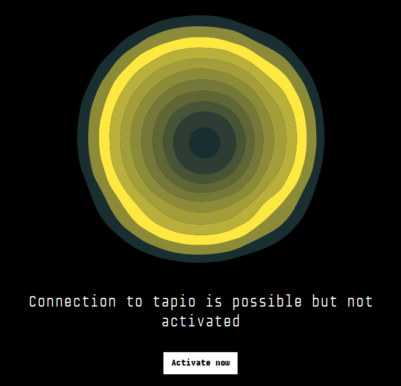
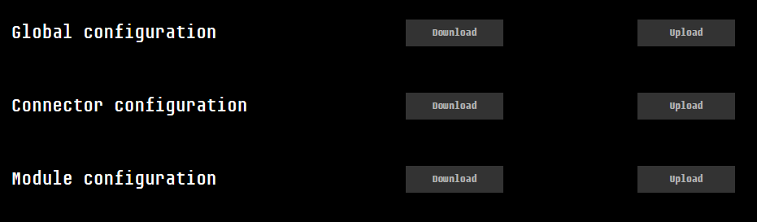

# tapio CloudConnector user interface

Starting with the sdk version TODO, the tapio CloudConnector
comes with a browser based user interface that combines a
Activator UI and Diagnostic UI.

By default the user interface is available at port 5555 of the
machine the tapio CloudConnector is installed on - eg.
`http://localhost:5555` in case the
browser is running on the same machine.

## Activate your CloudConnector

After opening the user interface in your browser, the color of
the tapio logo will tell you the current state of your CloudConnector.
If your CloudConnector is fully operational but not yet activated,
your screen will look like this:



Clicking the ```Activate now``` button will open up a new page
that guides you through the activation process.

## Expert View

The expert view can be reached via clicking the `Expert` button
in the UI menu on the left side, it provides some extended features
like restarting the CloudConnector, downloading logs and update/download the configuration.

### Configuration Update

On the expert view there is a section for uploading and downloading configuration files:



As described in [Distributed Configuration](../configuration#distributed-configuration) there is the possibility to split
the configuration up into three files. For each configuration file the UI provides a download and upload button.

Procedure to update a configuration file:

1. Click in the expert view on upload to open the upload dialog
2. Select the new configuration file
3. Click on upload to transfer the configuration to the CloudConnector
4. Click on restart CloudConnector to use the new configuration

> Note: When uploading an invalid configuration file, the CloudConnector will revert back to the previous configuration. A configuration file is considered invalid, when the CloudConnector cannot start using it, e.g. if it contains syntax errors (which means it is an invalid XML file or contains invalid configuration options), but does not consider misconfigurations like using unavailable OPC UA servers.

Possible errors when downloading a configuration file:

- There is no connection to the CloudConnector
- The configuration has no split configuration, so the file is not available
- The configuration has a split configuration but the file is not yet uploaded
- The CloudConnector has no permissions to read the file

Possible errors when uploading a configuration file:

- There is no connection to the CloudConnector
- The configuration has no split configuration, so the CloudConnector does not know how to store the file
- The CloudConnector has no permissions to write the file

#### Transition from single configuration to split configuration

A single configuration CloudConnector can be changed to a split configuration by proceeding the following steps:

1. Configure a global configuration to contain the the `source`-property as described in [Distributed Configuration](../configuration#distributed-configuration)
2. Upload the global configuration and restart the CloudConnector
   - To keep the CloudConnector functional keep the section contents
   Configure the configuration files for the different configuration sections
3. Upload the required configuration sections
4. Restart the CloudConnector
5. Remove the content of the sections in the global configuration which are now loaded from the `source`-attribute location.
6. Upload the global configuration and restart the CloudConnector

## Configuration of the UI

The default settings of the ui can be overwritten with a custom appsettings.json file

> By default the path for windows is: `C:\ProgramData\tapio\CloudConnectorUI\appsettings.json`.
> For Linux it is `/opt/tapio/cloudconnectorui/config/appsettings.json`.

To use a direct connection to the CloudConnector instead of the OPC UA Local Discovery Service it could be configured like this:

```json
{
  ...
  "Diagnostic": {
    "DiaOpcUaConcreteName": "opc.tcp://localhost:4433/CloudConnectorDiagnostic/"
  }
  ...
}
```

Additionally in the file **TapioCloudconnector.xml** there has to be a corresponding entry.
It is crucial that the parameter value from the **appsettings.json** is matching the parameter of the **TapioCloudconnector.xml**.

### Windows

| Path                                       | File                    | Parameter            | Value                                              |
| ------------------------------------------ | ----------------------- | -------------------- | -------------------------------------------------- |
| %PROGRAMDATA%\tapio\CloudConnectorUi\      | appsettings.json        | DiaOpcUaConcreteName | opc.tcp://localhost:4433/CloudConnectorDiagnostic/ |
| %PROGRAMDATA%\tapio\CloudConnector\config\ | TapioCloudconnector.xml | OpcUaServerUrl       | opc.tcp://localhost:4433/CloudConnectorDiagnostic/ |
|                                            |                         |                      |                                                    |
  
### Linux

| Path                              | File                    | Parameter            | Value                                              |
| --------------------------------- | ----------------------- | -------------------- | -------------------------------------------------- |
| opt/tapio/cloudconnectorui/config | appsettings.json        | DiaOpcUaConcreteName | opc.tcp://localhost:4433/CloudConnectorDiagnostic/ |
| opt/tapio/cloudconnector/config   | TapioCloudconnector.xml | OpcUaServerUrl       | opc.tcp://localhost:4433/CloudConnectorDiagnostic/ |
|                                   |                         |                      |                                                    |

The value of the parameter *OpcUaServerUrl* in the **TapioCloudconnector.xml** header area should look like the following.
If the entry is missing you can copy that line form the example here and place it into the file on the machine. If the
parameter is not present in the  **TapioCloudconnector.xml** the CloudConnector will try to resolve *CloudConnectorDiagnostic* by
the OPC UA Local Discovery Service.  

Excerpt of TapioCloudConnector.xml:

```xml
<?xml version="1.0"?>
<GlobalConfig xmlns:xsi="http://www.w3.org/2001/XMLSchema-instance" xmlns:xsd="http://www.w3.org/2001/XMLSchema">
  <ConnectorConfig>
     ...
     <OpcUaServerUrl>opc.tcp://localhost:4448/CloudConnectorDiagnostic/</OpcUaServerUrl>
     ...
  </ConnectorConfig>
  <Modules>
  ...
  </Modules>
</GlobalConfig>
```

To configure the log file size and the log file count add the following entries:

```json
{
  ...
  "Logging": {
    "LogFileCount" : 5,
    "LogFileSize" : "10M"
  }
  ...
}
```

| Property       | Description                                                                                                                                                                   |
| -------------- | ----------------------------------------------------------------------------------------------------------------------------------------------------------------------------- |
| `LogFileCount` | The count of log files to use, at least 1, default 10.                                                                                                                        |
| `LogFileSize`  | The max size per log file, min `4K` (4 KiB)  , default `10M` (10 MiB), format `{number}{unit}`, allowed units:  `K` - KiB, `M` - MiB, `G` - GiB. See below for more examples. |

Examples for **`LogFileSize`**:

| Value            | Description                                  |
| ---------------- | -------------------------------------------- |
| `{number}{unit}` |                                              |
| `4K`             | 4 Kilobyte = 4096 Byte                       |
| `1M`             | 1 Megabyte = 1024 Kilobyte = 1048576 Bytes |
| `10M`            | 10 Megabyte = 10240 Kilobyte               |
| `1G`             | 1 Gigabyte = 1024 Megabyte                   |

> Note: Any change inside the binary folder may be overwritten by auto updates

## Troubleshooting

### I can't open the management ui

1. Make sure you are using the correct name or IP address together
   with the correct port. The default port is 5555, in any other
   case you find the bound port in the ```appsettings.json```
   file of your UI folder.
2. Make sure the UI service is actually running on the target machine.

### Error "Connection to CloudConnector could not be established"

1. Make sure the CloudConnector service is actually running
2. Make sure the UI service can connect to the CloudConnector service.
    - The UI service requires an OPC UA connection to the
      CloudConnector service. Make sure the ```DiaOpcUaLdsName```
      or ```DiaOpcUaConcreteName``` configuration in your UI
      ```appsettings.json``` matches the
      [configuration](../configuration#global-configuration) of your
      CloudConnector
    - In case these services run on different machines, make sure network
      connectivity is given
